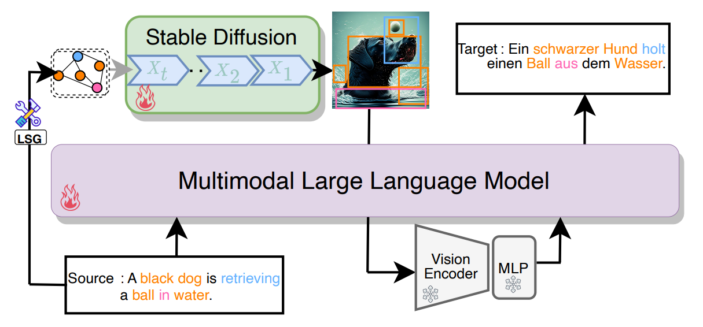

<div align="center">


## <a href="https://arxiv.org/abs/2412.12627">Make Imagination Clearer! Stable Diffusion-based Visual Imagination for Multimodal Machine Translation</a>


</div>

## Introduction

Visual information has been introduced for enhancing machine translation (MT), and its effectiveness heavily relies on the availability of large amounts of bilingual parallel sentence pairs with manual image annotations. In this paper, we introduce a stable diffusion-based imagination network into a multimodal large language model (MLLM) to explicitly generate an image for each source sentence, thereby advancing the multimodel MT. Particularly, we build heuristic human feedback with reinforcement learning to ensure the consistency of the generated image with the source sentence without the supervision of image annotation, which breaks the bottleneck of using visual information in MT. Furthermore, the proposed method enables imaginative visual information to be integrated into large-scale text-only MT in addition to multimodal MT. Experimental results show that our model significantly outperforms existing multimodal MT and text-only MT, especially achieving an average improvement of more than 14 BLEU points on Multi30K multimodal MT benchmarks.


The illustration is shown below:



## Citation

If you find our work IMAGE useful in your research, please cite the paper:

```bibtex
@misc{chen2024makeimaginationclearerstable,
      title={Make Imagination Clearer! Stable Diffusion-based Visual Imagination for Multimodal Machine Translation}, 
      author={Andong Chen and Yuchen Song and Kehai Chen and Muyun Yang and Tiejun Zhao and Min Zhang},
      year={2024},
      eprint={2412.12627},
      archivePrefix={arXiv},
      primaryClass={cs.CL},
      url={https://arxiv.org/abs/2412.12627}, 
}
```

## Installation

### Prerequisites

Make sure your OS is a Linux distro, such as `Arch Linux`, `Ubuntu`, etc. Our project doesn't support `Windows`.

### Download Necessary Models

Download [`Stable-Diffusion-2-1-base`](https://huggingface.co/stabilityai/stable-diffusion-2-1-base), [`all-MiniLM-L6-v2`](https://huggingface.co/sentence-transformers/all-MiniLM-L6-v2), [`Vicuna-7B-v1.5`](https://huggingface.co/lmsys/vicuna-7b-v1.5)and [`clip-vit-large-patch14`](https://huggingface.co/openai/clip-vit-large-patch14).


After Downloading, make sure you have modified the path in `modeling.modeling_plugins` properly. The paths to these models are hard coded.

### Download Dataset

You could download our data from [BaiduCould](https://pan.baidu.com/s/17wQc6lYWAXj3ydp5qIFEvQ?pwd=k2bp ). The raw images can be requested [here](https://github.com/multi30k/dataset) for Flickr30k. 

### Setup Basic Python Environment

This is the most difficult part to install our project. You can try this to install some basic packages:

```shell
conda env create -f main.yml
```

If any error occurs, please consider manually installing the packages which cause errors.


If you have setup the environment properly, you will be able to run `test.py` without any error.

### Install LSG Module

If you setup the basic environment properly, you can simply run:

```shell
cd graph/LSG
pip install -e .
```

### Install VSG Module

We recommend you follow the guide from [`Scene-Graph-Benchmark.pytorch`](https://github.com/KaihuaTang/Scene-Graph-Benchmark.pytorch/blob/master/INSTALL.md). However, you should use our `maskrcnn_benchmark` in `graph/VSG/` because the version we provide can be installed on higher version of `PyTorch`.


As for pretrained VSG checkpoint, please visit [`Scene-Graph-Benchmark.pytorch`](https://github.com/KaihuaTang/Scene-Graph-Benchmark.pytorch/) for more information. You should place the checkpoint in `graph/VSG/checkpoint/`.

### Install `ParroT`

Please visit [`ParroT`](https://github.com/wxjiao/ParroT) for instructions.

## Dataset Preparation

### Multi30K

Multi30K datasets can be downloaded here: [Multi30K](https://github.com/multi30k/dataset). After that, Please visit [`ParroT`](https://github.com/wxjiao/ParroT) for instructions on how to construct the training dataset.

### Custom Datasets

You should prepare two files, like `src.en` and `tgt.de`. In `src.en`, each line should be a sentence you want to translate. In `tgt.de`, each line should be the ground-truth sentence in German corresponding to the line in `src.en`.


After that, Please visit [`ParroT`](https://github.com/wxjiao/ParroT) for instructions on how to construct the training dataset.

## Training

 ### Alignment Human Feedback Learning

Run `graph/trl_sd.sh`. For example:

```shell
#!/bin/sh

CUDA_LAUNCH_BLOCKING=1 CUDA_VISIBLE_DEVICES=3 python trl_sd.py \
--sd_model "./stable_diffusion" \
--IMAGE_model "./IMAGE_pretrained" \
--sim_model "./all_miniLM" \
--detect_model "./graph/VSG/checkpoint" \
--detect_cfg "./VSG/configs/e2e_relation_X_101_32_8_FPN_1x.yaml" \
--topk 30 \
--dataset "./multi30k_en_de_train.json" \
--img_storage_path "tempo" \
--num_epochs 50 \
--train_batch_size 1 \
--sample_batch_size 1 \
--train_learning_rate 5e-5 \
--logging_dir "./log/" \
--ckpt_dir "./saves/" \
MODEL.ROI_RELATION_HEAD.USE_GT_BOX False \
MODEL.ROI_RELATION_HEAD.USE_GT_OBJECT_LABEL False \
MODEL.ROI_RELATION_HEAD.PREDICTOR CausalAnalysisPredictor \
MODEL.ROI_RELATION_HEAD.CAUSAL.EFFECT_TYPE TDE \
MODEL.ROI_RELATION_HEAD.CAUSAL.FUSION_TYPE sum \
MODEL.ROI_RELATION_HEAD.CAUSAL.CONTEXT_LAYER motifs \
TEST.IMS_PER_BATCH 1 \
TEST.CUSTUM_EVAL True \
DTYPE "float16" \
GLOVE_DIR ./VSG/glove/ \
MODEL.PRETRAINED_DETECTOR_CKPT ./VSG/checkpoint/ \
OUTPUT_DIR ./VSG/checkpoint/ \
DETECTED_SGG_DIR ./tempo

```

### MLLM Training

Run `ParroT/full_IMAGE.sh`. For example:

```shell
# Multi-nodes are also supported

export NCCL_DEBUG=INFO
export NCCL_SOCKET_IFNAME=enp83s0f1
export NCCL_IB_GID_INDEX=3
export NCCL_IB_SL=3
export NCCL_NET_GDR_READ=1
export DS_SKIP_CUDA_CHECK=1

export MASTER_ADDR="${CHIEF_IP:=localhost}"
export MASTER_PORT="${MASTER_PORT:=31600}"
export HOST_NUM=1
export INDEX=0


wandb offline

train_path=transformers/examples/pytorch/language-modeling/chain_of_train.py
model_path="./Vicuna"
model_save="./model_save"
sim_model="./all-miniLM"
train_file="./multi30k_en_de.json"


# HOST_NUM will be 1
torchrun --nnodes $HOST_NUM --node_rank $INDEX --nproc_per_node 4 --master_addr $MASTER_ADDR --master_port $MASTER_PORT  \
    ${train_path} \
    --model_name_or_path ${model_path} \
    --deepspeed train/deepspeed_config_zero2.json \
    --train_file ${train_file} \
    --preprocessing_num_workers 1 \
    --dataloader_num_workers 1 \
    --dataloader_pin_memory True \
    --per_device_train_batch_size 16 \
    --per_device_eval_batch_size 2 \
    --gradient_accumulation_steps 1 \
    --num_train_epochs 1.5 \
    --save_strategy "steps" \
    --save_steps 5 \
    --save_total_limit 1 \
    --learning_rate 2e-5 \
    --weight_decay 0. \
    --warmup_ratio 0.03 \
    --lr_scheduler_type "cosine" \
    --logging_steps 1 \
    --block_size 512 \
    --do_train \
    --evaluation_strategy "no" \
    --validation_split_percentage 1 \
    --fp16 True \
    --fp16_full_eval True \
    --ddp_timeout 3600 \
    --seed 1 \
    --gradient_checkpointing True \
    --output_dir ${model_save} \
    --lora_path "../graph/save_parrot/checkpoints/checkpoint_48/"

# Use streaming for large datasets and specify the max_steps
#    --streaming \
#    --max_steps 2500 \

```

## Inference

Run `inference.sh`. For example:

```shell
#!/bin/bash

CUDA_VISIBLE_DEVICES=0 python inference.py \
--mid_product_image_path "./generated_images" \
--sd_lora_path "./sd_lora" \
--src_lang_file "./test.en" \
--tgt_lang_file "./test.de" \
--IMAGE_llm_model_path "./IMAGE" \
--output_file "./output/test_en_de.jsonl"
```

The output file will be like this:

```json
{
    "src": "爱是恒久忍耐，又有恩慈，爱是不嫉妒，爱是不自夸，不张狂。",
    "tgt": "Love is patient, love is kind; love does not envy, love does not boast, it is not arrogant.",
    "hyp": "Love is patient, love is kind, it is not jealous; love does not brag, it is not arrogant."
}
```

1. `src` is the original sentence which to be translated.
2. `tgt` is the ground-truth translation.
3. `hyp` is the translation generated by LLMs.

## Troubleshooting

### Unable to run shell scripts

This might be the problem of file format.

1. Open the script using `Vim`.
2. Type `:set ff=unix`.
3. Save and quit.

## Download our model
You could download our [IMAGE_En2De](https://modelscope.cn/models/andongchen/IMAGE_DE) and [IMAGE_EN2Fr](https://modelscope.cn/models/andongchen/IMAGE_FR) models from ModelScope.

## Acknowledgement
This project cannot be developed without the following resources:

- Parrot: https://github.com/wxjiao/ParroT
- Dreamllm: https://github.com/RunpeiDong/DreamLLM
- Stanford Alpaca: https://github.com/tatsu-lab/stanford_alpaca
- Tower: https://huggingface.co/Unbabel/TowerBase-7B-v0.1
- ALMA: https://huggingface.co/haoranxu/ALMA-7B-R
